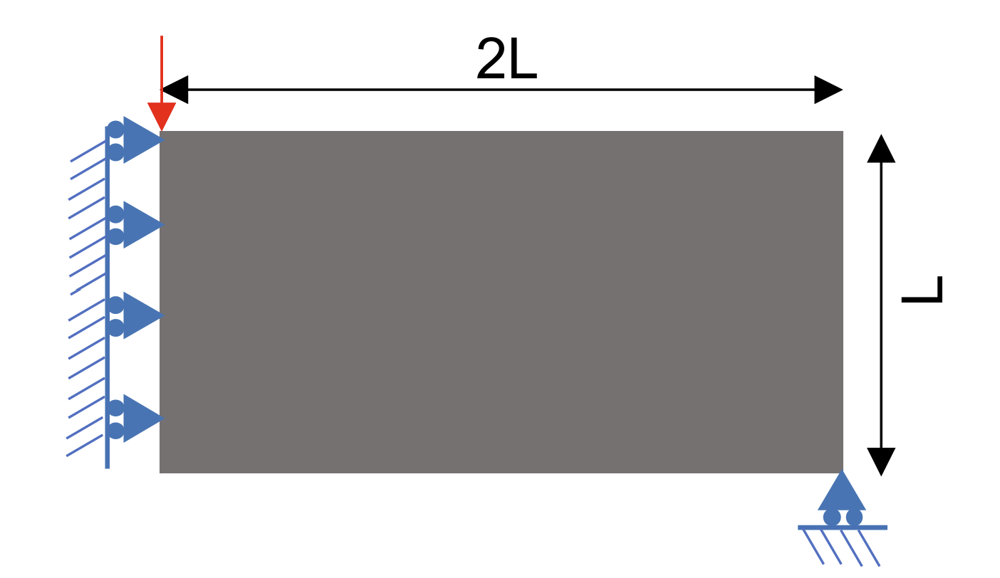
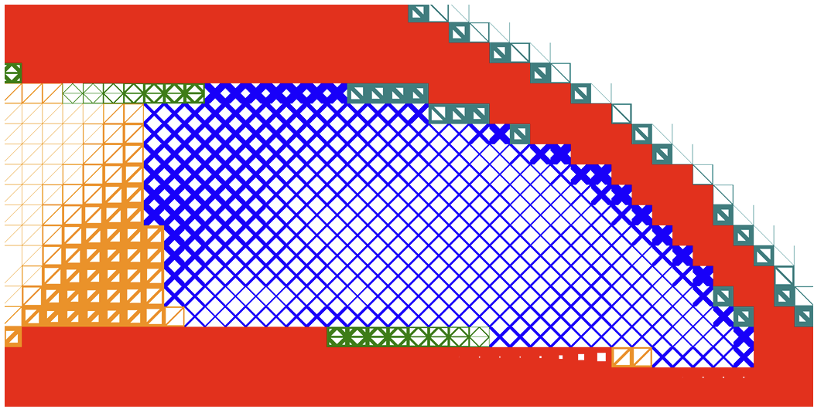

# Topology Optimization meets Machine Learning

This repository contains the code and workflow and exercise to run **graded multiscale topology optimization using neural networks (GM-TOuNN)[^1]**, explore designs by varying mesh resolution and target volume fraction, and **reconstruct and validate** optimized designs with **Gmsh** + **PrePoMax/CalculiX**. 

This exercise is part of the "KI meets VHB" funding program of the "Data Acquisition, Processing and Analysis in Manufacturing Engineering and Material Science" lecture at the 'Virtuelle Hochschule Bayern' (vhb).

---

## What this project does

### Goal
Learn how computation-driven structural design and machine learning can produce lightweight, high-performance load-bearing geometries by efficiently distributing material in a design domain using fast neural networks. Figure 1 provides a concrete example of this workflow, showing the design domain and boundary conditions (Fig. 1a) and a corresponding optimized structure (Fig. 1b) produced with the topology optimization approach of Chandrasekhar et al. [^1]. 

|  |  |
|:-----------------------------------------:|:----------------------------------------:|
|       **(a)** Design domain and problem setup       |      **(b)** Optimized domain       |

*Figure 1: Typical topology optimization problem with problem definition and boundary conditions, Fig. 1a, and candidate design solution, Fig. 1b obtained by using the topology
optimization algorithm from Chandrasekhar et al. [^1].*

### What makes GM-TOuNN different
Instead of optimizing element densities directly, GM-TOuNN uses:
- a **library of microstructure unit cells** (e.g., square / xbox / xpbox),
- **homogenized effective properties** for each unit cell,
- and a **neural network** that maps element coordinates `(x, y)` →
  **(unit cell type, wall thickness / volume fraction control)**.

This reduces computational costs by avoiding explicit micro-geometry resolution in the global FE mesh, enabling fast design-space exploration.

---

## Repository structure

- `environment.yml` - Python Anaconda environment of the project
- `main_TOuNN.py` - main file to run a topology optimization
- `config.txt` - problem selection, mesh, training, and saving options
- `gmsh_from_predictions.py` - design reconstruction and meshing using Gmsh; export geometry model as `.inp` file for subsequent FEM validation

---

## Prerequisites

### Software
- **[Anaconda](https://www.anaconda.com/download)** (Python distribution & environment manager)
- **[PyCharm](https://www.jetbrains.com/pycharm)** (recommended) or VS Code
- **[Gmsh](https://gmsh.info/)** (for reconstruction and geometry meshing)
- **[PrePoMax](https://prepomax.fs.um.si/)** (GUI pre/post for **CalculiX**) to run validation simulations

---
## References
This work was developed based on the work of Chandrasekhar et al.:

[^1]: Chandrasekhar, Aaditya; Sridhara, Saketh; Suresh, Krishnan. *GM-TOuNN...* arXiv:2204.06682 (2022). https://arxiv.org/abs/2204.06682